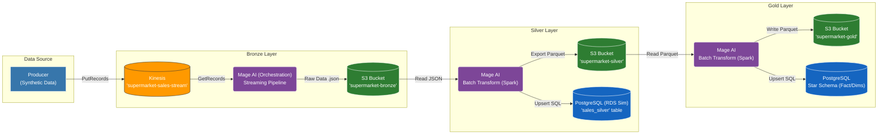

# Supermarket Real-Time Stock Lakehouse 


## Business Problem
Retailers face significant losses due to **stockouts** (out-of-stock events) and **overstocking**. This project solves this by implementing a real-time stock management platform. By analyzing streaming sales events, the system provides immediate visibility and predictive alerts to ensure products are replenished exactly when needed.

## Architecture Diagram


```mermaid
flowchart LR
    classDef aws fill:#FF9900,stroke:#232F3E,color:white;
    classDef python fill:#3776AB,stroke:white,color:white;
    classDef mage fill:#7D4698,stroke:white,color:white;
    classDef storage fill:#2E7D32,stroke:white,color:white;
    classDef database fill:#1565C0,stroke:white,color:white;
    classDef future fill:#f5f5f5,stroke:#d2d2d2,color:#d2d2d2,stroke-dasharray: 5 5;

    subgraph "Data Source"
        Producer["Producer<br/>(Synthetic Data)"]:::python
    end

    subgraph "Bronze Layer"
        direction TB
        Kinesis[("Kinesis<br/>'supermarket-sales-stream'")]:::aws
        Mage("Mage AI (Orchestration)<br/>Streaming Pipeline"):::mage
        S3Bronze[("S3 Bucket<br/>'supermarket-bronze'")]:::storage
        
    end

    subgraph "Silver Layer"
        direction TB
        Mage2("Mage AI<br/>Batch Transform (Spark)"):::mage
        S3Silver[("S3 Bucket<br/>'supermarket-silver'")]:::storage
        Postgres[("PostgreSQL (RDS Sim)<br/>'sales_silver' table")]:::database
    end

    subgraph "Gold Layer"
        Mage3("Mage AI<br/>Batch Transform (Spark)"):::mage
        S3Gold[("S3 Bucket<br/>'supermarket-gold'")]:::storage
        PostgresGold[("PostgreSQL<br/>Star Schema (Fact/Dims)")]:::database
    end


    Producer -->|PutRecords| Kinesis
    Kinesis -->|GetRecords| Mage
    Mage -->|Raw Data .json| S3Bronze

    S3Bronze -->|Read JSON| Mage2
    Mage2 -->|Export Parquet| S3Silver
    Mage2 -->|Upsert SQL| Postgres

    S3Silver -->|Read Parquet| Mage3
    Mage3 -->|Write Parquet| S3Gold
    Mage3 -->|Upsert SQL| PostgresGold
```

## Architecture (Medallion + Lakehouse)
This project follows the **Medallion Architecture** to ensure data quality and traceability:
- **Bronze Layer**: Raw sales events stored in S3 (JSON format).
- **Silver Layer**: Cleaned and partitioned data using Spark (Parquet format).
- **Gold Layer**: Business-level aggregates modeled in a **Star Schema** served via PostgreSQL for low-latency analytical queries.

## Data Journey (The Pipeline)
1. **Producer**: A Python script simulates POS transactions (sales events) and streams them to **AWS Kinesis**.
2. **Ingestion**: Data is persisted from Kinesis into the **S3 Bronze Layer** (Raw JSON) for audit purposes.
3. **Orchestration**: **Mage AI** triggers Spark jobs to process new data.
4. **Transformation**: **PySpark** cleans the data, handles schemas, and saves it to the **S3 Silver Layer** (Parquet).
5. **Analytics**: Aggregated metrics (stock levels, sales velocity) are loaded into **PostgreSQL (Gold Layer)** using a Star Schema.

## Roadmap
| Phase | Feature | Description |
|---|---|---|
| 4 | **Testing & CI/CD** | Unit tests for Spark transformations (pytest + PySpark) and automated execution via GitHub Actions on every push |
| 5 | **Reliability** | SQS Dead Letter Queue to capture and retry failed Kinesis records; S3 bucket policies to enforce least-privilege access per layer |
| 6 | **Alerting** | Rule-based detection of products falling below safety stock threshold, generating alerts from the Gold layer |
| 7 | **Demand Forecasting** | ML pipeline consuming the Gold layer to forecast future sales per product and store (Prophet / XGBoost) |
| 8 | **Fraud Detection** | Anomaly detection on transactions to flag suspicious patterns (Isolation Forest) |
| 9 | **Visualization** | Expose the Star Schema to BI tools (PowerBI Desktop / Apache Superset) for self-service dashboards |

## Tech Stack
- **Cloud Simulation**: [LocalStack](https://localstack.cloud/) (S3, Kinesis, IAM).
- **Orchestration**: [Mage AI](https://www.mage.ai/) (Modern alternative to Airflow).
- **Data Processing**: [Apache Spark](https://spark.apache.org/) (PySpark).
- **Infrastructure as Code**: [Terraform](https://www.terraform.io/).
- **Database**: [PostgreSQL](https://www.postgresql.org/) (Serving layer).
- **Containerization**: [Docker](https://www.docker.com/) & Docker Compose.

## Setup & Execution

### Phase Initial: Infrastructure 

<details>
<summary><b>Click to show Steps 1 to 7: Environment</b></summary>

1. **Prerequisites**: Install **Docker** and **Docker Compose**. (Project tested on Windows via **WSL2**).

2. **Clone**: 

```bash 
git clone https://github.com/Gramser-DE/Supermarket-Stock-Lakehouse
```

3. **Environment**: Create a `.env` file in the root directory (refer to `.env.example`): 

```bash 
cp .env.example .env
```

4. **Launch Services**: Run `docker-compose` to start the backend infrastructure (LocalStack, PostgreSQL, and Mage AI).

```bash 
docker-compose up -d
```

5. **Deploy Infrastructure**: Use the containerized Terraform to provision S3 buckets and Kinesis streams:

```bash 
docker-compose -f docker-compose.infra.yml run --rm terraform init
docker-compose -f docker-compose.infra.yml run --rm terraform apply
```

6. **Verification**: Confirm that the resources (buckets: bronze, silver, gold) are active in LocalStack using a containerized AWS CLI: 

```bash 
docker run --rm -it --network supermarket_net --env-file .env amazon/aws-cli --endpoint-url=http://localstack:4566 s3 ls
```

7. **Kinesis Verification**: Confirm that the stream is active and check its shards:

```bash 
docker run --rm -it --network supermarket_net --env-file .env amazon/aws-cli --endpoint-url=http://localstack:4566 kinesis describe-stream --stream-name supermarket-sales-stream
```
</details>

### Phase 1: Bronze Layer
<details>
<summary><b>Click to show Steps 8 to 10: Ingestion</b></summary>

8.  **Run Data Ingestion(Producer)**: Launch the synthetic data generator in a transient container: 

```bash 
docker run --rm -it   --network supermarket_net   --env-file .env   -v "$(pwd):/app"   -w /app   python:3.10-slim   sh -c "pip install boto3 -q && python -m scripts.data_producer.main"
```

9.  **Run Data Ingestion(Orchestrator)**:Access the Mage UI at `http://localhost:6789`, open the `kinesis_to_bronze_ingestion` pipeline, and press the `Run@once` button to start consuming records.

10. **Verify Bronze Layer**: Validate that the raw JSON files are being persisted in the S3:

```bash 
docker run --rm -it --network supermarket_net --env-file .env amazon/aws-cli --endpoint-url=http://localstack:4566 s3 ls s3://supermarket-bronze/sales_data/ --recursive
```

</details>

### Phase 2: Silver Layer
<details>
<summary><b>Click to show Steps 11 to 13: Cleaning & Loading</b></summary>

11. **Initialize Data Warehouse**: Apply the SQL schema to PostgreSQL:

```bash 
source .env && docker exec -i supermarket-aws-lakehouse-postgres-1 psql -U $POSTGRES_USER -d $POSTGRES_DB < scripts/init_silver_db.sql

source .env && docker exec -it supermarket-aws-lakehouse-postgres-1 psql -U $POSTGRES_USER -d $POSTGRES_DB -c "\dt sales_silver"
```

12. **Run Transformation Pipeline (Orchestrator)**:Access the Mage UI at `http://localhost:6789`, open the `bronze_to_silver_ingestion` pipeline, and click `Run@once` button to start the processing and loading phase.


13. **Verify Data**: Check that refined Parquet files exist in S3 and query the final PostgreSQL table to validate data integrity:

```bash 
docker run --rm -it --network supermarket_net --env-file .env amazon/aws-cli --endpoint-url=http://localstack:4566 s3 ls s3://supermarket-silver/ --recursive

source .env && docker exec -it $POSTGRES_HOST psql -U $POSTGRES_USER -d $POSTGRES_DB -c "SELECT * FROM sales_silver LIMIT 5;"
```

</details>

### Phase 3: Gold Layer
<details>
<summary><b>Click to show Steps 14 to 16: Star Schema & Loading</b></summary>

14. **Initialize Data Warehouse**: Apply the SQL schema to PostgreSQL:

```bash 
source .env && docker exec -i supermarket-aws-lakehouse-postgres-1 psql -U $POSTGRES_USER -d $POSTGRES_DB < scripts/init_gold_db.sql

source .env && docker exec -it supermarket-aws-lakehouse-postgres-1 psql -U $POSTGRES_USER -d $POSTGRES_DB -c "\dt"
```

15. **Run Transformation Pipeline (Orchestrator)**:Access the Mage UI at `http://localhost:6789`, open the `silver_to_gold_ingestion` pipeline, and click `Run@once` button to start the processing and loading phase.


16. **Verify Data**: Check that refined Parquet files exist in S3 and query the final PostgreSQL table to validate data integrity:

```bash 
docker run --rm -it --network supermarket_net --env-file .env amazon/aws-cli --endpoint-url=http://localstack:4566 s3 ls s3://supermarket-gold/ --recursive

source .env && docker exec -it $POSTGRES_HOST psql -U $POSTGRES_USER -d $POSTGRES_DB -c "
SELECT
    f.transaction_id,
    p.product_name,
    p.product_category,
    s.store_id,
    d.full_date,
    pm.payment_method,
    ct.client_type,
    f.quantity,
    f.unit_price,
    f.total_price
FROM fact_sales f
JOIN dim_product p ON f.product_key = p.product_key
JOIN dim_store s ON f.store_key = s.store_key
JOIN dim_date d ON f.date_key = d.date_key
JOIN dim_payment_method pm ON f.payment_method_key  = pm.payment_method_key
JOIN dim_client_type ct ON f.client_type_key = ct.client_type_key
LIMIT 10;
"

source .env && docker exec -it $POSTGRES_HOST psql -U $POSTGRES_USER -d $POSTGRES_DB -c "
SELECT 'fact_sales' AS table, COUNT(*) FROM fact_sales
UNION ALL SELECT 'dim_product', COUNT(*) FROM dim_product
UNION ALL SELECT 'dim_store', COUNT(*) FROM dim_store
UNION ALL SELECT 'dim_payment_method', COUNT(*) FROM dim_payment_method
UNION ALL SELECT 'dim_client_type', COUNT(*) FROM dim_client_type;
"
```
</details>