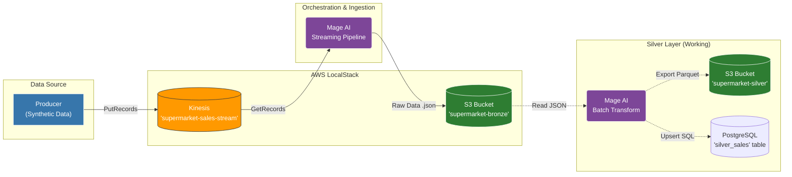

# Supermarket Real-Time Stock Lakehouse 


## Business Problem
Retailers face significant losses due to **stockouts** (out-of-stock events) and **overstocking**. This project solves this by implementing a real-time stock management platform. By analyzing streaming sales events, the system provides immediate visibility and predictive alerts to ensure products are replenished exactly when needed.

## Architecture Diagram



## Architecture (Medallion + Lakehouse)
This project follows the **Medallion Architecture** to ensure data quality and traceability:
- **Bronze Layer**: Raw sales events stored in S3 (JSON format).
- **Silver Layer**: Cleaned and partitioned data using Spark (Parquet format).
- **Gold Layer**: Business-level aggregates modeled in a **Star Schema** served via PostgreSQL for low-latency analytical queries.

## Data Journey (The Pipeline)
1. **Producer**: A Python script simulates POS transactions (sales events) and streams them to **AWS Kinesis**.
2. **Ingestion**: Data is persisted from Kinesis into the **S3 Bronze Layer** (Raw JSON) for audit purposes.
3. **Orchestration**: **Mage AI** triggers Spark jobs to process new data.
4. **Transformation**: **PySpark** cleans the data, handles schemas, and saves it to the **S3 Silver Layer** (Parquet).
5. **Analytics**: Aggregated metrics (stock levels, sales velocity) are loaded into **PostgreSQL (Gold Layer)** using a Star Schema.
6. **Alerting**: The system identifies products below the safety stock threshold.

## Tech Stack
- **Cloud Simulation**: [LocalStack](https://localstack.cloud/) (S3, Kinesis, IAM).
- **Orchestration**: [Mage AI](https://www.mage.ai/) (Modern alternative to Airflow).
- **Data Processing**: [Apache Spark](https://spark.apache.org/) (PySpark).
- **Infrastructure as Code**: [Terraform](https://www.terraform.io/).
- **Database**: [PostgreSQL](https://www.postgresql.org/) (Serving layer).
- **Containerization**: [Docker](https://www.docker.com/) & Docker Compose.

## Setup & Execution

1. **Prerequisites**: Install **Docker** and **Docker Compose**. (Project tested on Windows via **WSL2**).

2. **Clone**: 

```bash 
git clone https://github.com/Gramser-DE/Supermarket-Stock-Lakehouse
```

3. **Environment**: Create a `.env` file in the root directory (refer to `.env.example`): 

```bash 
cp .env.example .env
```

4. **Launch Services**: Run `docker-compose` to start the backend infrastructure (LocalStack, PostgreSQL, and Mage AI).

```bash 
docker-compose up -d
```

5. **Deploy Infrastructure**: Use the containerized Terraform to provision S3 buckets and Kinesis streams:

```bash 
docker-compose -f docker-compose.infra.yml run --rm terraform init
docker-compose -f docker-compose.infra.yml run --rm terraform apply
```

6. **Verification**: Confirm that the resources (buckets: bronze, silver, gold) are active in LocalStack using a containerized AWS CLI: 

```bash 
docker run --rm -it --network supermarket_net --env-file .env amazon/aws-cli --endpoint-url=http://localstack:4566 s3 ls
```

7. **Kinesis Verification**: Confirm that the stream is active and check its shards:

```bash 
docker run --rm -it --network supermarket_net --env-file .env amazon/aws-cli --endpoint-url=http://localstack:4566 kinesis describe-stream --stream-name supermarket-sales-stream
```

8.  **Run Data Ingestion(Producer)**: Launch the synthetic data generator in a transient container: 

```bash 
docker run --rm -it   --network supermarket_net   --env-file .env   -v "$(pwd):/app"   -w /app   python:3.10-slim   sh -c "pip install boto3 -q && python scripts/producer.py"
```

9.  **Run Data Ingestion(Orchestrator)**:Access the Mage UI at `http://localhost:6789`, open the `kinesis_to_bronze_ingestion` pipeline, and press the `execute pipeline` button to start consuming records.

10. **Verify Bronze Layer**: Validate that the raw JSON files are being persisted in the S3:

```bash 
docker run --rm -it --network supermarket_net --env-file .env amazon/aws-cli --endpoint-url=http://localstack:4566 s3 ls s3://supermarket-bronze/sales_data/ --recursive
```

## Project Milestones (3-Week Sprint)
### Week 1: Infrastructure & Ingestion
- [x] **Environment**: LocalStack & Docker Compose orchestration.
- [x] **IaC**: Terraform provisioning for Kinesis Streams and S3 Bronze.
- [x] **Data Generation**: Custom Python Producer for synthetic sales events.
- [x] **Ingestion Pipeline**: Mage AI streaming from Kinesis to S3 Bronze.

### Week 2: Silver Layer & Relational Storage
- [ ] **S3-to-Silver Batch Pipeline**: Develop a Mage AI batch process to consume raw JSON records from the Bronze layer.
- [ ] **Data Refinement & Cleaning**: Implement schema enforcement, normalize timestamps (UTC), and handle null values.
- [ ] **Dual-Destination Persistence**:
    - **S3 Silver**: Export refined data in **Parquet** format for high-performance analytical storage.
    - **PostgreSQL**: Upsert cleaned records into the `silver_sales` table for relational querying.
- [ ] **Idempotency Logic**: Ensure data consistency and prevent duplicate records during batch reprocessing.

### Week 3: Serving & Analysis
- [ ] **Analytical Modeling**: Transition from flat tables to a **Star Schema** (Fact & Dimension tables).
- [ ] **Business Logic**: Aggregate metrics (e.g., total sales per store, stock alerts) in the Gold layer.
- [ ] **Data Serving**: Finalize PostgreSQL views for easy consumption by BI tools or APIs.
- [ ] **Documentation & Final Test**: End-to-end validation and technical project write-up.